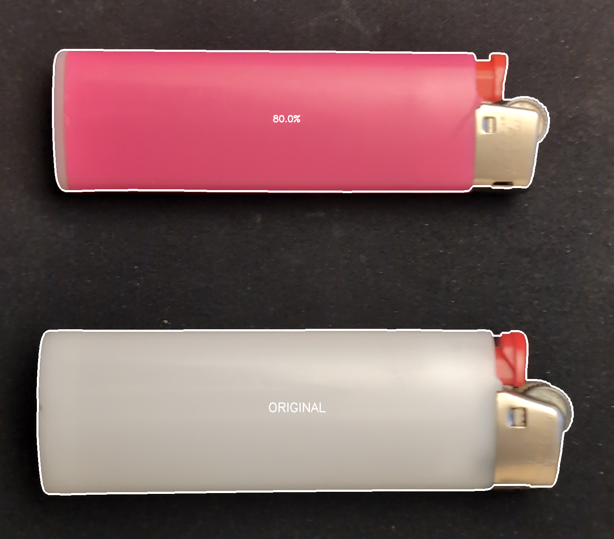

# Splitr

A browser-based PWA that uses OpenCV.js (WebAssembly) to detect, outline, and measure the relative area of fragments in an image — no server, no upload, fully offline after first load.

**Live:** `https://MerzSebastian.GitHub.io/Splitr/`

---

## Example

Upload a photo of two objects on a plain background — the app outlines each one and calculates how large each piece is relative to the reference:

| Input | Result |
|---|---|
|  |  |

In this example the smaller object is detected as ~80 % of the larger reference, with both outlined and labelled directly on the canvas.

---

## Use Cases

Useful whenever a flat object is split into pieces and you need to know each piece's share of the whole — for example, comparing cut part dimensions against reference tolerances for QC purposes.

---

## Quick Start

```bash
# clone the repo, then serve locally
python -m http.server 8000
# open http://localhost:8000
```

Or just push to GitHub — the included Actions workflow deploys automatically to GitHub Pages.

---

## Parameters

| Parameter | What it does |
|---|---|
| Blur | Reduces noise before thresholding |
| Threshold | Brightness cut-off to separate objects from background |
| Morph Size / Close / Open | Clean up the binary mask (fill holes, remove specks) |
| Min Area | Ignore contours smaller than this (px²) |

**Options**
- *Adjusted %* — normalize all fragments so they sum to 100 %
- *No Original Reference* — skip the largest-rectangle detection; treat all detected pieces equally

**Value Conversion** — enter the known total value (weight, count, …) and a unit; each fragment's share is calculated and shown on the canvas.

---

## Tech

- OpenCV.js (WebAssembly) — all processing in-browser
- Vanilla JS / HTML5 Canvas — zero dependencies
- Service Worker — offline support after first visit
- Web App Manifest — installable PWA

